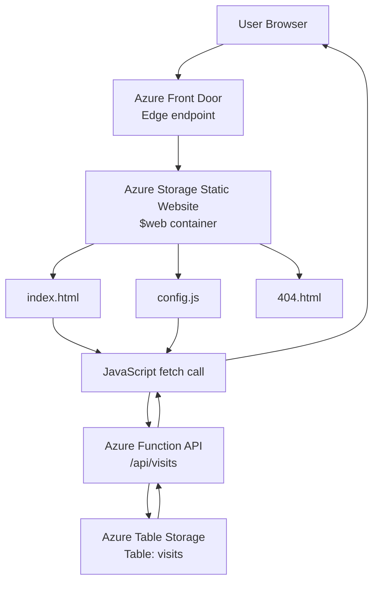
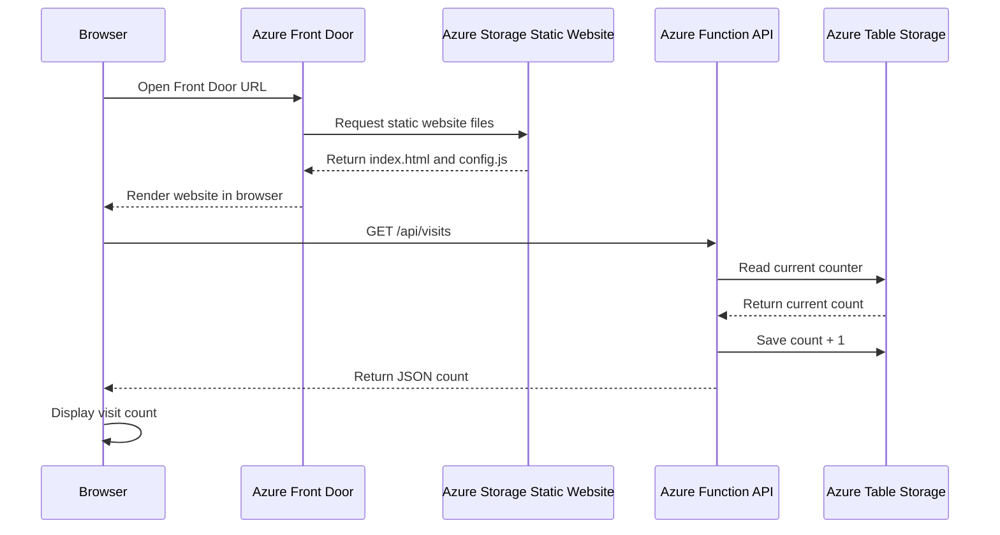

# CST8921 Lab 6 – Code-First Static Web Delivery on Azure

## 1. What this project does

In this lab, I deployed a static website on Azure using a code-first approach.

The main idea was:

- Use Python SDK instead of only clicking in Azure Portal.
- Create Azure resources with code.
- Upload website files to Azure Storage Static Website.
- Add an Azure Function API for a dynamic visit counter.
- Put Azure Front Door in front of the website.
- Clean up all resources with a script.

This is useful because real cloud work should be repeatable. If I need to build the same environment again, I can follow the same scripts and commands.

---

## 2. Main architecture



### How the architecture works

The user opens the website in the browser.

At the end of the lab, the user visits the Azure Front Door URL first. Front Door receives the request and forwards it to the Azure Storage Static Website endpoint.

Azure Storage serves the static website files from the `$web` container:

- `index.html`
- `config.js`
- `404.html`

The `index.html` file loads in the browser. Then JavaScript reads the API base URL from `config.js`.

After that, the browser calls the Azure Function API:

```text
/api/visits
```

The Azure Function reads the current visit count from Azure Table Storage. Then it adds 1, saves the new value, and returns JSON back to the browser.

Example response:

```json
{"count": 6}
```

The browser receives this JSON and shows the number on the page.

The website itself is static, but the visit counter is dynamic because it comes from Azure Function and Azure Table Storage.

---

## 3. Service responsibilities

| Service | What it does in this lab |
|---|---|
| Azure Resource Group | Keeps all lab resources together |
| Azure Storage Account | Stores the static website files and table data |
| `$web` container | Special container for Azure Storage Static Website |
| Azure Function App | Hosts the serverless API |
| Azure Table Storage | Stores the visit counter value |
| Azure Front Door | Provides edge endpoint and caching |
| Python SDK | Creates/configures resources and uploads files |
| Azure CLI | Login, role assignment, Function App, and Front Door commands |

---

## 4. Project structure

```text
cst8921-lab6_azure_static_web/
│
├── provision.py
├── enable_static_website.py
├── deploy.py
├── deploy_bad_content_type.py
├── cleanup.py
│
├── site/
│   ├── index.html
│   ├── config.js
│   └── 404.html
│
└── api/
    ├── function_app.py
    ├── host.json
    └── requirements.txt
```

### Important files

| File | Purpose |
|---|---|
| `provision.py` | Creates resource group and storage account |
| `enable_static_website.py` | Enables static website hosting on the storage account |
| `deploy.py` | Uploads website files with correct content type and cache-control |
| `deploy_bad_content_type.py` | Used only to test the bad content-type problem |
| `cleanup.py` | Deletes the whole resource group |
| `site/index.html` | Main website page |
| `site/config.js` | Stores the API base URL |
| `site/404.html` | Custom 404 page |
| `api/function_app.py` | Azure Function visit counter API |

---

## 5. Secret and GitHub safety

Do not push these files/folders to GitHub:

```text
.venv/
__pycache__/
api/local.settings.json
*.pyc
*.zip
```

`api/local.settings.json` can contain local settings or storage connection information. It should stay on the local machine.

A safe `.gitignore` for this project:

```gitignore
.venv/
__pycache__/
*.pyc
*.zip
*.log

api/local.settings.json
.python_packages/
api/.python_packages/
.DS_Store
```

---

## 6. Setup commands

### Login to Azure

```bash
az login
az account show
```

### Set environment variables

I used `eastus` because `canadacentral` was not available in my lab subscription.

```bash
export AZURE_SUBSCRIPTION_ID="<subscription-id>"
export AZURE_RG="cst8921-lab6-rg"
export STORAGE_ACCOUNT_NAME="cst8921lab6ilyas01"
export AZURE_LOCATION="eastus"
```

### Create Python virtual environment

```bash
python3 -m venv .venv
source .venv/bin/activate
```

### Install Python packages

```bash
pip install azure-identity azure-mgmt-resource azure-mgmt-storage azure-storage-blob azure-data-tables azure-functions
```

---

## 7. Step-by-step flow

### Step 1 – Provision Azure resources

Run:

```bash
python provision.py
```

What this does:

- Creates the resource group.
- Creates the storage account.
- Uses Azure management-plane SDK.
- Uses a poller because storage account creation is a long-running operation.

---

### Step 2 – Assign data-plane permission

Run:

```bash
USER_OBJECT_ID=$(az ad signed-in-user show --query id -o tsv)

az role assignment create \
  --assignee-object-id "$USER_OBJECT_ID" \
  --assignee-principal-type User \
  --role "Storage Blob Data Owner" \
  --scope "/subscriptions/$AZURE_SUBSCRIPTION_ID/resourceGroups/$AZURE_RG/providers/Microsoft.Storage/storageAccounts/$STORAGE_ACCOUNT_NAME"
```

Why this is needed:

Creating the storage account is control-plane work. Uploading files and changing blob settings is data-plane work. That is why the Storage Blob Data role is needed.

---

### Step 3 – Enable static website hosting

Run:

```bash
python enable_static_website.py
```

What this does:

- Enables static website hosting.
- Creates/uses the `$web` container.
- Sets `index.html` as the default page.
- Sets `404.html` as the error page.

Important gotcha:

```text
Correct: error_document404_path
Wrong:   error_document_404_path
```

The script reads the service properties back from Azure to confirm the setting.

---

### Step 4 – Deploy the static website

Run:

```bash
python deploy.py
```

What this does:

- Uploads files from the `site/` folder to the `$web` container.
- Sets correct content types.
- Sets cache-control headers.

Important content types:

```text
index.html -> text/html
config.js  -> text/javascript or application/javascript
404.html   -> text/html
```

---

### Step 5 – Test content-type problem

Run:

```bash
python deploy_bad_content_type.py
```

What this proves:

If `index.html` is uploaded without correct `ContentSettings`, the browser may download the file instead of rendering the website.

Fix it by running:

```bash
python deploy.py
```

This uploads files again with correct content type.

---

### Step 6 – Create Azure Function API

Go to the API folder:

```bash
cd api
```

Install dependencies:

```bash
pip install -r requirements.txt
```

Run the Function locally:

```bash
func start
```

Test the local API:

```bash
curl http://localhost:7071/api/visits
```

Expected output:

```json
{"count": 1}
```

Run it again and the count should increase.

---

### Step 7 – Deploy Azure Function to Azure

Set Function App name:

```bash
export FUNCTION_APP_NAME="cst8921-lab6-api-ilyas01"
```

Create the Function App:

```bash
az functionapp create \
  --resource-group "$AZURE_RG" \
  --name "$FUNCTION_APP_NAME" \
  --storage-account "$STORAGE_ACCOUNT_NAME" \
  --consumption-plan-location "$AZURE_LOCATION" \
  --runtime python \
  --runtime-version 3.12 \
  --functions-version 4 \
  --os-type Linux
```

Publish the Function:

```bash
func azure functionapp publish "$FUNCTION_APP_NAME"
```

Test the deployed API:

```bash
curl "https://$FUNCTION_APP_NAME.azurewebsites.net/api/visits"
```

---

### Step 8 – Connect static website to deployed API

Go back to the main folder:

```bash
cd ..
```

Update `site/config.js`:

```javascript
window.API_BASE = "https://cst8921-lab6-api-ilyas01.azurewebsites.net";
```

If the browser caches `config.js`, use cache busting in `index.html`:

```html
<script src="config.js?v=2"></script>
```

Redeploy the site:

```bash
python deploy.py
```

Open the storage website endpoint. The visit counter should now show a number instead of `API unavailable`.

---

### Step 9 – Create Azure Front Door

Set the storage static website host:

```bash
export WEB_HOST="cst8921lab6ilyas01.z13.web.core.windows.net"
```

Create Front Door profile:

```bash
az afd profile create \
  -g "$AZURE_RG" \
  --profile-name cst8921-afd \
  --sku Standard_AzureFrontDoor
```

Create endpoint:

```bash
az afd endpoint create \
  -g "$AZURE_RG" \
  --profile-name cst8921-afd \
  --endpoint-name lab6site
```

Create origin group:

```bash
az afd origin-group create \
  -g "$AZURE_RG" \
  --profile-name cst8921-afd \
  --origin-group-name og \
  --probe-request-type GET \
  --probe-protocol Https \
  --probe-interval-in-seconds 120 \
  --probe-path / \
  --sample-size 4 \
  --successful-samples-required 3 \
  --additional-latency-in-milliseconds 50
```

Create origin:

```bash
az afd origin create \
  -g "$AZURE_RG" \
  --profile-name cst8921-afd \
  --origin-group-name og \
  --origin-name storage-web \
  --host-name "$WEB_HOST" \
  --origin-host-header "$WEB_HOST" \
  --https-port 443 \
  --priority 1 \
  --weight 1000 \
  --enabled-state Enabled
```

Create route:

```bash
az afd route create \
  -g "$AZURE_RG" \
  --profile-name cst8921-afd \
  --endpoint-name lab6site \
  --route-name default \
  --origin-group og \
  --supported-protocols Https \
  --patterns-to-match "/*" \
  --forwarding-protocol HttpsOnly \
  --https-redirect Enabled \
  --link-to-default-domain Enabled
```

Get the Front Door URL:

```bash
az afd endpoint show \
  -g "$AZURE_RG" \
  --profile-name cst8921-afd \
  --endpoint-name lab6site \
  --query hostName \
  -o tsv
```

Open:

```text
https://<front-door-host-name>
```

Important:

Use the storage static website endpoint as the origin:

```text
cst8921lab6ilyas01.z13.web.core.windows.net
```

Do not use the blob endpoint:

```text
cst8921lab6ilyas01.blob.core.windows.net
```

---

### Step 10 – Purge Front Door cache

Run:

```bash
az afd endpoint purge \
  -g "$AZURE_RG" \
  --profile-name cst8921-afd \
  --endpoint-name lab6site \
  --content-paths '/*'
```

What this does:

It clears cached files from Azure Front Door edge servers. This is useful after deployment when users may still receive old content.

---

### Step 11 – Cleanup

Run only after screenshots and report evidence are saved:

```bash
python cleanup.py
```

What this does:

- Deletes the whole resource group.
- Removes storage account, Function App, Front Door, and related resources.
- Helps avoid extra cost.

The cleanup script is idempotent because it checks if the resource group exists before deleting it.

---

## 8. Main concepts I learned

### Imperative IaC

This lab used imperative IaC. That means the code tells Azure step by step what to do.

Example:

```text
Create resource group
Create storage account
Enable static website
Upload files
Create Function App
Create Front Door
Delete resources
```

Terraform and Bicep are more declarative. They describe the final state. This lab mainly used Python SDK, so it was imperative.

### Control plane

Control plane means managing Azure resources.

Examples:

- Create resource group
- Create storage account
- Delete resource group

In this lab, `provision.py` and `cleanup.py` used the control plane.

### Data plane

Data plane means working with data or service content inside a resource.

Examples:

- Upload files to `$web`
- Set Blob service static website properties
- Read/write table data

In this lab, `enable_static_website.py`, `deploy.py`, and the visit counter used the data plane.

### Content type

A browser needs correct content type to know how to handle a file.

If `index.html` is served as `application/octet-stream`, the browser may download it.

If `index.html` is served as `text/html`, the browser renders it as a webpage.

### CORS

The website and API are on different domains. The browser blocks cross-origin JavaScript calls unless the API allows it.

The Azure Function returned this header:

```text
Access-Control-Allow-Origin: *
```

This allowed the static website to call the API.

### Edge caching

Azure Front Door can cache files closer to users. This improves speed, but it can also serve old content after deployment.

That is why cache purge is needed.

---

## 9. Common issues and fixes

### Python command not found

Use:

```bash
python3 -m venv .venv
```

### Function command not found

Install Azure Functions Core Tools v4.

Check:

```bash
func --version
```

### Browser downloads HTML

Run the correct deploy script:

```bash
python deploy.py
```

This sets `text/html`.

### API unavailable

Check:

- `site/config.js` has the deployed Function App URL.
- `index.html` uses the latest config file.
- The Function App is deployed and working.
- CORS header is included in `function_app.py`.

### Front Door page not found

Check:

- Route exists.
- Route is linked to default domain.
- Origin uses `web.core.windows.net`, not `blob.core.windows.net`.
- Wait for Azure Front Door propagation.

---

## 10. Final build summary



In simple words:

Azure Storage hosts the website. Azure Function handles the dynamic counter. Azure Table Storage remembers the count. Azure Front Door serves the website from an edge endpoint. Python and Azure CLI are used to build and manage everything.
